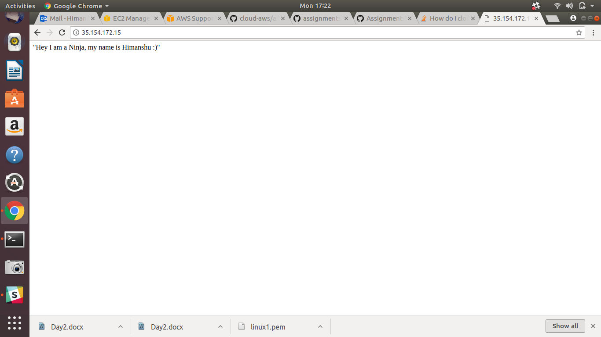

# AWS Assignment Day-3

### Task 1
> Create a linux t2.micro ec2 instance. After logging into this instance move /etc/sudoers file with /etc/sudoers.bkp 

Once you move the sudoers file you won't be able to use sudo

Fix>>

1. Shutdown the instance.  

2. Detach the storage device.

  

3. Create a new EC2 instance and attach the corrupted volume to it.

  

4. Mount the drive and edit the sudoers file of corrupted volume.  

5. Attache the volume to previous instance.  

6. Try now
  

> issue resolved

### Task 2
> create an ansible role before pushing the same to your public github repository.

> This Role will simply host an nginx webpage saying
  - "Hi i am ninja and my name is {yourname}" 

> Execute this role in user data script while launching another instance

> Your website should be up & running after the system boots up

> tag this instance as `ninja:yourname`

DataScript used:

User data script:

#!/bin/bash
sudo su
cd /
apt-get update -y
apt-get install software-properties-common -y
apt-add-repository ppa:ansible/ansible
apt-get update -y
apt-get install ansible -y
apt-get install git -y
git clone https://github.com/arorah23/AWSPlaybook.git
cd AWSPlaybook
ansible-playbook main.yml

### Task 3
> write a jobDsl to start stop this instance through jenkins  

#
  NOTE!
  - Make Documentation: Done
  - Don't commit and push your AWS Keys on any public repository: Alright
