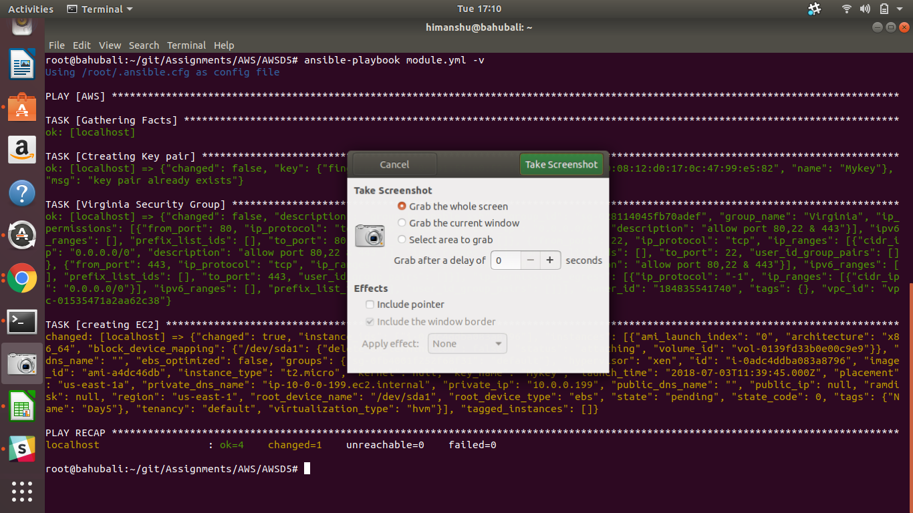
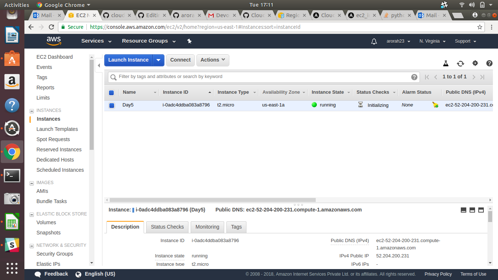

#Task 1
####Launch below infrastructure in your aws account using ansible's aws cloud modules

create a key pair using ansible
create one security group that would allow you to ssh into the instance
using the key that you created, launch an instance in default vpc of N.virginia region with tags of your choice

Playbook: 
