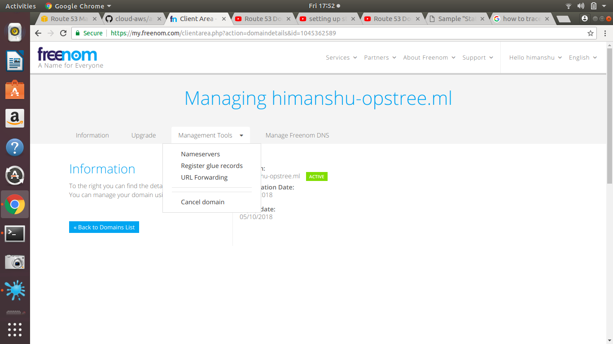
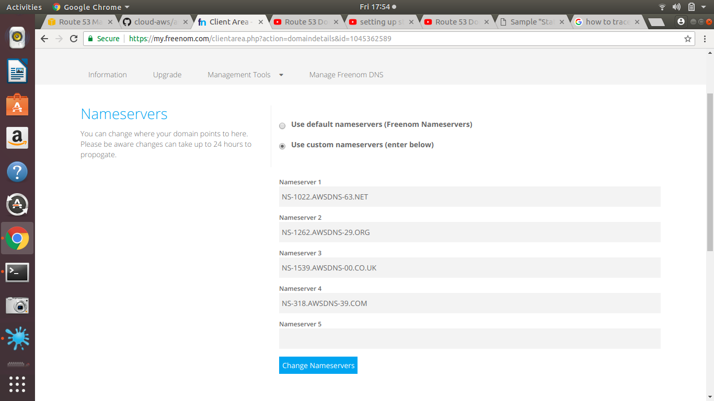
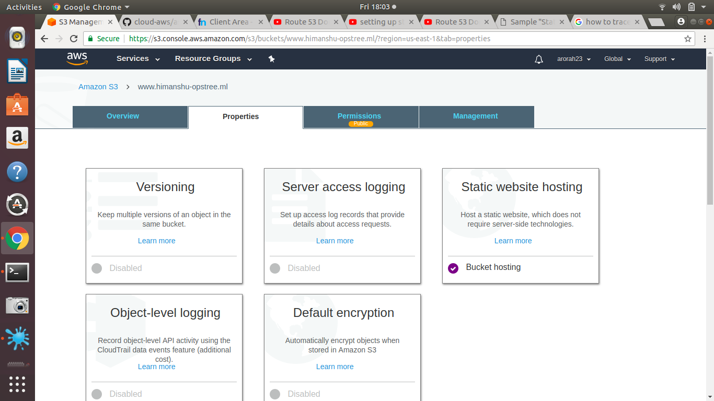
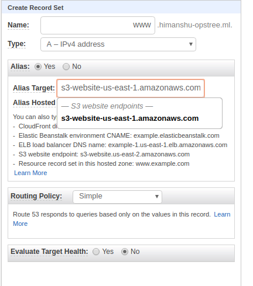
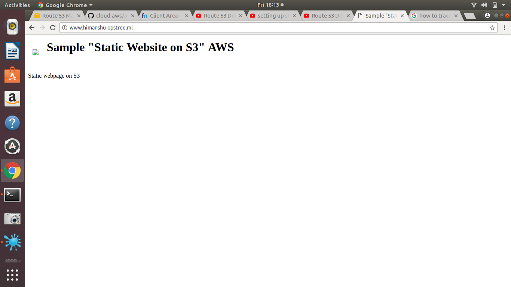

# Task 1
## Host a static website using s3 as follows:

## Buy a domain from Freenom as yourname.opstree.com

- To buy a domain we need to first create an account on Freenom.  
- click on Services>Register a new domain.  
- check the availability of your desired domain name.  
- checkout after selecting the domain.  
- use dns if you want to host the website on freenom only, in this assignment we are going to migrate it to route 53 so it doesn't matter.  
- click on continue.  
- on this page it will ask you to enter your personal details.  
- once done click on complete order.  
- Congrats your domain is now registered.  

### Domain name created himanshu-opstree.ml

## Migrate this domain to Route53

- now the second step is to migrate the site on Router 53  
- (A quick link for your reference)[https://www.youtube.com/watch?v=HwZ3wNaM69s]  
- Go to your AWS account, in the services choose Route 53  
- There you will get multiple options, but as we are migrating our site we have to choose DNS Management  
- over there create a new hosted zone: keep the name of zone as your Domain name which you registered > choose the zone type as public.  

- It will automatically create 2 set of records for you.  
- We have to use the record with type NS(name space).  
- Copy the values of the name space, and go to Freenom.  

- In Freenom, go to: Services> My Domain > Manage Domain >> Management Tools > Nameservers.  

- Paste the name servers one by one.  

- Now once you change the name server it would take minimum 15-20 minutes and Max 24 hours to migrate it.  
 
Host a static website using s3 bucket.

- create a S3 bucket.
- Once Bucket is created open the bucket and in the properties option choose static website hosting

- enter the name of the index document
- Upload the index file in bucket

Now last but not the least step

- Go to Route 53 > Hosted zones> create Record set for alias of bucket
- This will route the hit on www.himanshu-opstree.ml to the bucket and serve the content
-  
- You can create one more record to route hit on himanshu-opstree.ml to www.himanshu-opstree.ml
- All set :)

