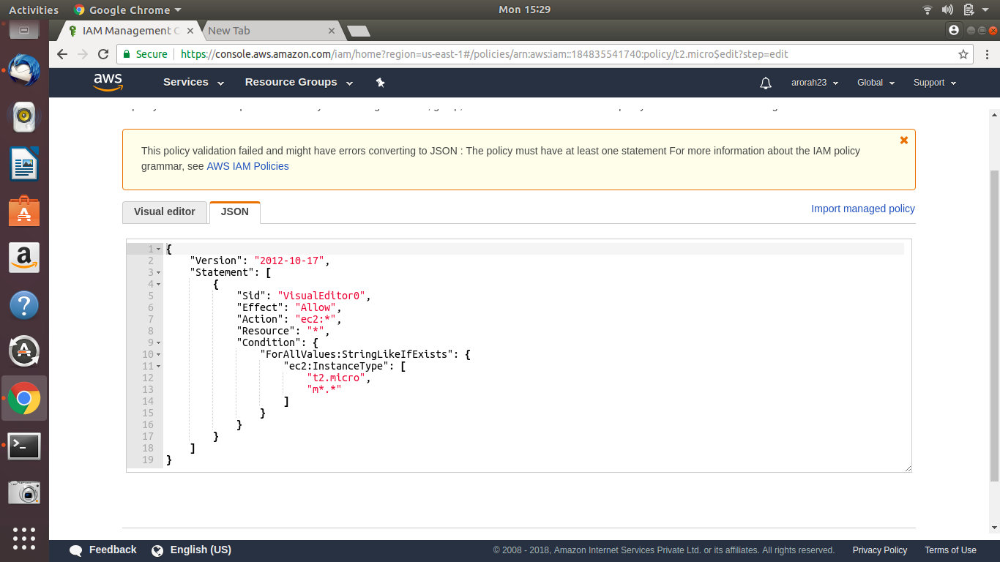
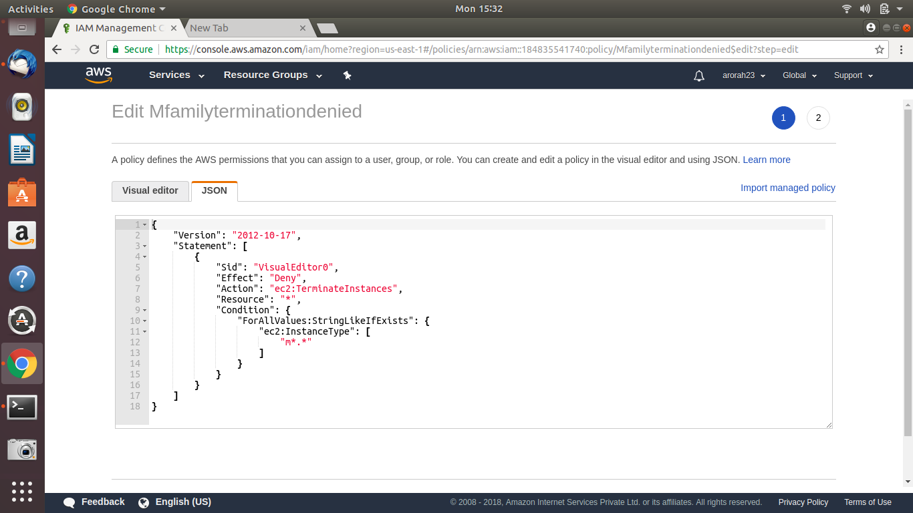
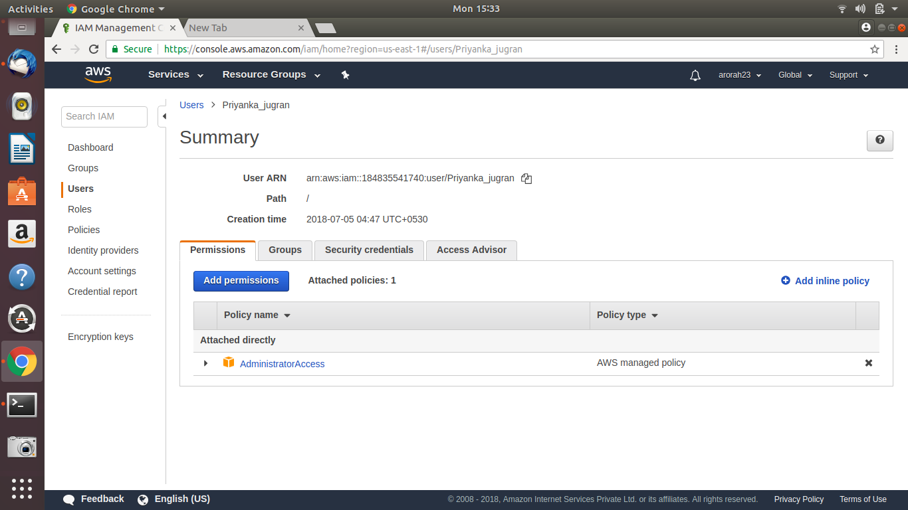
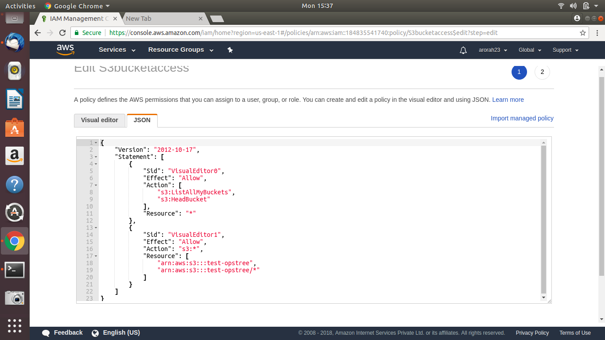
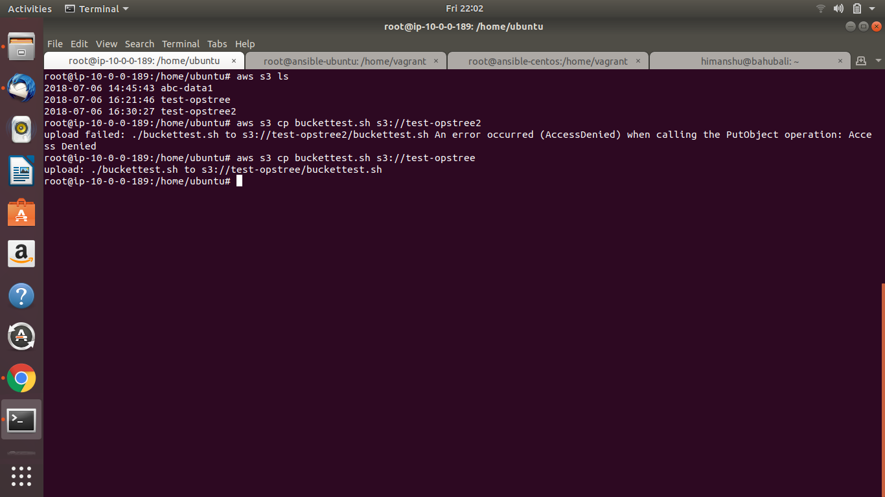
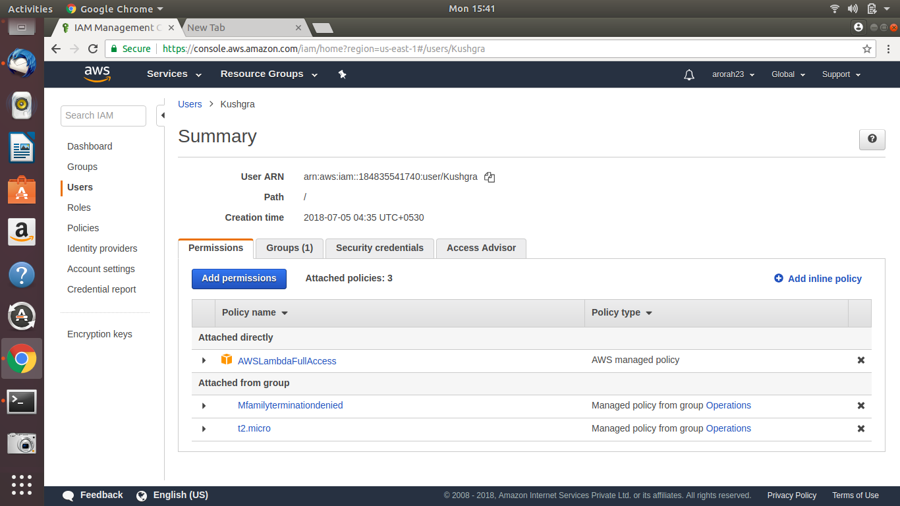
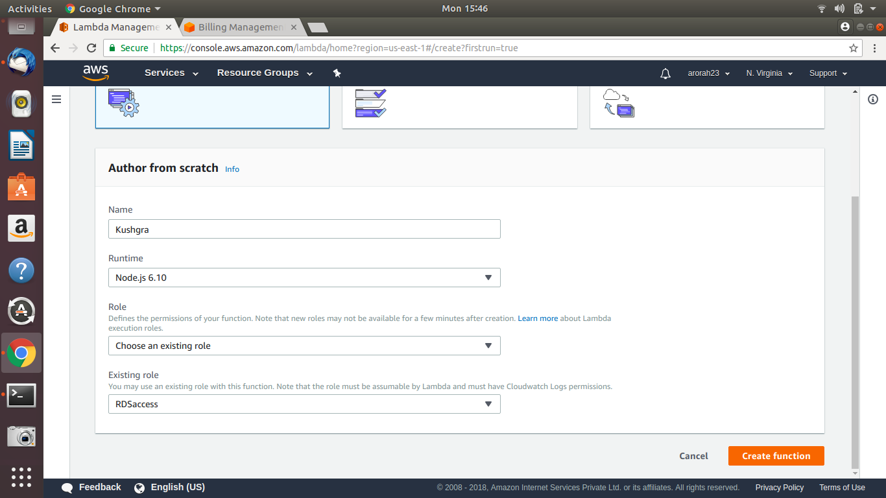

## Task 1
      
-- Rajat is the devops guy in 'abc' organization and he is responsible for creating 't2.micro' and all the 'm' family of instances as per requirement but he can't terminate 'm' family of instances but that's not the case with t2.micro.  

-- Tejasvi Rana has got root access to the account but he isn't a technical guy. He is always suspicious about Rajat's actions in company's aws account. Luckily Tejasvi has got a friend, Priyanka jugran, she is amazon certified and knows everything about aws. Tejasvi wants Priyanka to cross check rajat's IAM permissions.  

-- In order to do that, he gave priyanaka full access. Now priyanka needs s3 storage for one of her friend, priyanka sharama to run athena queries for data analysis,they don't want to pay for that from their own aws account.  

-- Jugran has created a bucket with name 'test-opstree' with a policy that sharma will only be able to access this bucket from a particular ec2 instance that she created & provided the user details to sharma.  

-- Rajat referenced his friends kavit and Vishwas to his organization and now all of them share the same permission level.  

-- Kushgra is also one of the team memebers from operations team but recently he has got a task to create and run lambda function that is going to access rds database.  

How many IAM groups gets created == 1 group gets created if Rajat, Kavit & Vishwas are also a part of operations team.  
                                    Else 2 groups will be created one Operations and the second one for Rajat, Kavit & Vishwas.

How many IAM users gets created == 6

Permissions associated with them  

Tejasvi is already the root user, hence no IAM account required.
Rajat, Kavit, Vishwas & Kushgra are in the same team so create obe group operations and assigned below policy to it.  

assigned complete access to Instance type t2.micro 
  

Denied termination permission on M family instances.
  

Priyana Jugran got full admin access.  

Priyanka Jugran assigned below  inline policy to an EC2 instance and shared the key with Priyanka sharma to access bucket through EC2.  
  

Testing on EC2 instance with inline policy.
  

Lambda full access to Kushgra apart from the policies in operations group

Assigned a role to lamda service allowing full access to RDS

While creating Labmda function assigned the RDS role created above. v 
  

