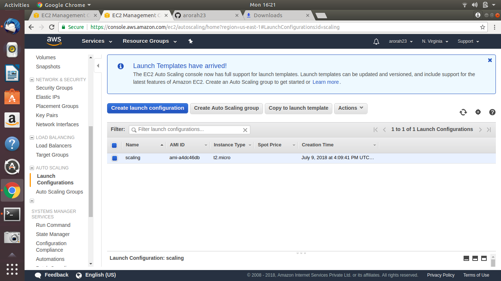

## Create an infrastructure that would scale as per load: Create cloudwatch alarms for scaling up and scaling down along with sns topic to notify you during any scaling operation

To create an infra: Go to Services > EC2

-- Create a Launch Configuration

-- Now create an Autoscaling group

Mention the policies for below condition:

scale up if av. cpu threashold > 70

scale down if av. cpu threashold < 40

  

Put fake load on the stack

To fully utilize the CPU
yes > /dev/null &

TO end all of it:

killall yes

Once you exhaust all the resources of your CPU, alert will be trigger and you will start receiving email notifications like below.

At this time AWS will initiate launch of a new Instance as per the launch configuraton settings.

In order to understand the workflow better, check the autoscaling group and you will find that value of desired state has been increased.

Once the second instance is also fully Exhausted desired state will be changed again.  

When the CPU percentage is gone below threshold you will receive another alert and the instances will start to get terminated.  

