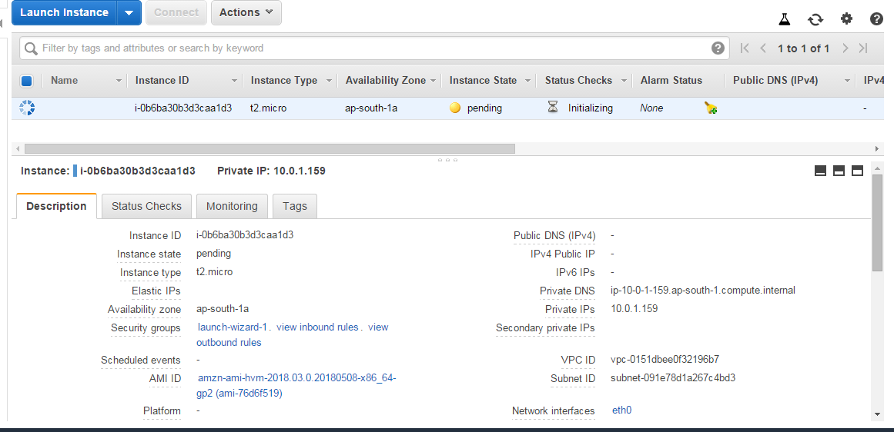
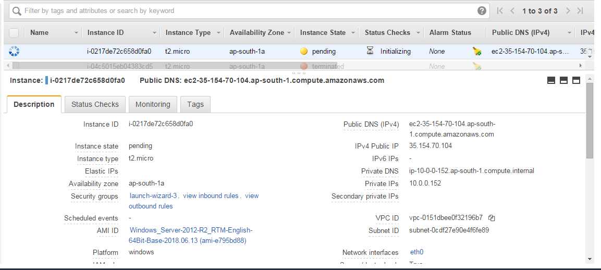
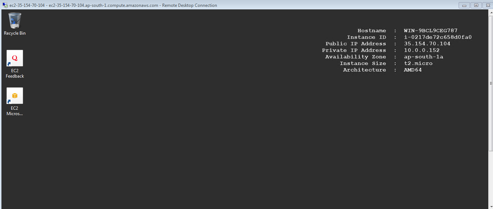
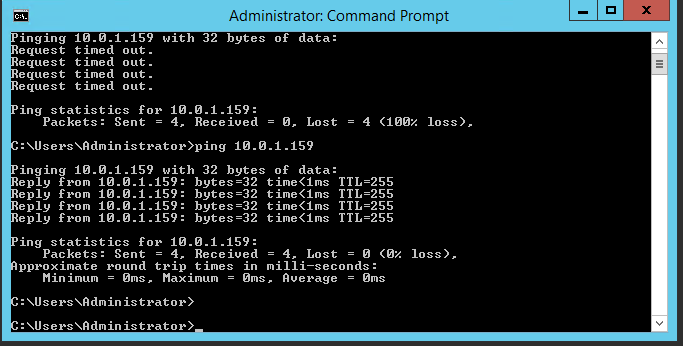

Task 1

## Create a vpc through wizard, having one public subnet and one private subnet.

- To create a VPC, log into your AWS account
 >> Services 
 > VPC
 > Create VPC 
 > VPC with Public and Private Subnets
 > Enter VPC name
 > Enter IPv4 CIDR:
 > Choose Availability Zone
 > Create Elastic IP for Private Subnet and assign it.
 > Click Create VPC
 > VPC created Successfully.
 

Task 2

## Create two instances within the vpc that you created in task 1, windows instance in public subnet and linux instance in private subnet. check if linux is pingable from windows and vice versa.
>> Services 
 	> EC2
1. Choose Instance Type
2. Configure Instance
3. Add Storage
4. Add Tags
5. Configure Security Group
7. Review

Do the above steps to launch both Private and Public

##Public Instance.

##Private Instance:

##Ping worked between Private and public Instance.

