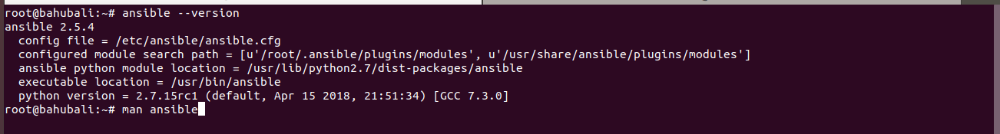
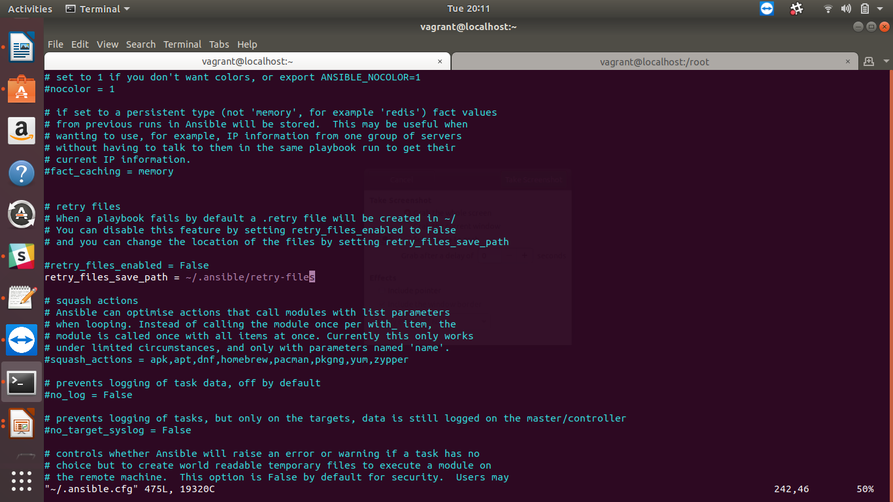
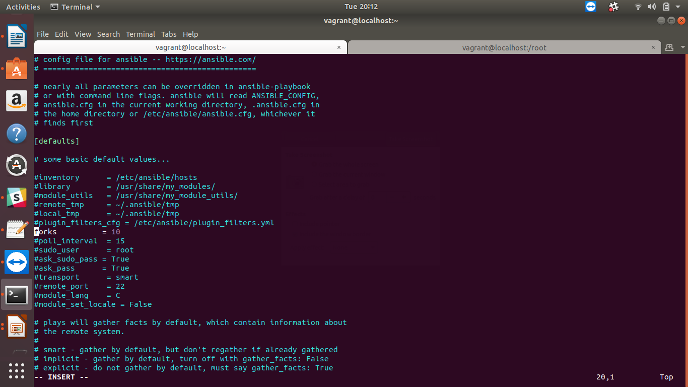

##The Assignment

####Use pip to install the ansible package and its dependencies to your control machine. 
-- sudo easy_install pip  
-- sudo pip install ansible   

####Display the Ansible version and man page to STDOUT.  

####Check all the possible parameters you need to know in ansible.cfg file.
Well there are multiple parameters about which we need to know, some of the basic parameters are below.
inventory      = /etc/ansible/hosts
library        = /usr/share/my_modules/
module_utils   = /usr/share/my_module_utils/
remote_tmp     = ~/.ansible/tmp
local_tmp      = ~/.ansible/tmp
plugin_filters_cfg = /etc/ansible/plugin_filters.yml
forks          = 5
poll_interval  = 15
sudo_user      = root
ask_sudo_pass = True
ask_pass      = True
transport      = smart
remote_port    = 22
module_lang    = C
module_set_locale = False

####Ansible Inventory: Check the default inventory file for ansible control master and use inventory, run ansible ping commands on various inventory groups. Try this on minimum of two virtual machines.(You can use any of these Docker/Vagrant)  

####In ~/.ansible.cfg file (create the file if it doesn't exist already) do the following:

#####Create a new directory ~/.ansible/retry-files and set retry_files_save_path to it.

####Set the Ansible system forks to 10

