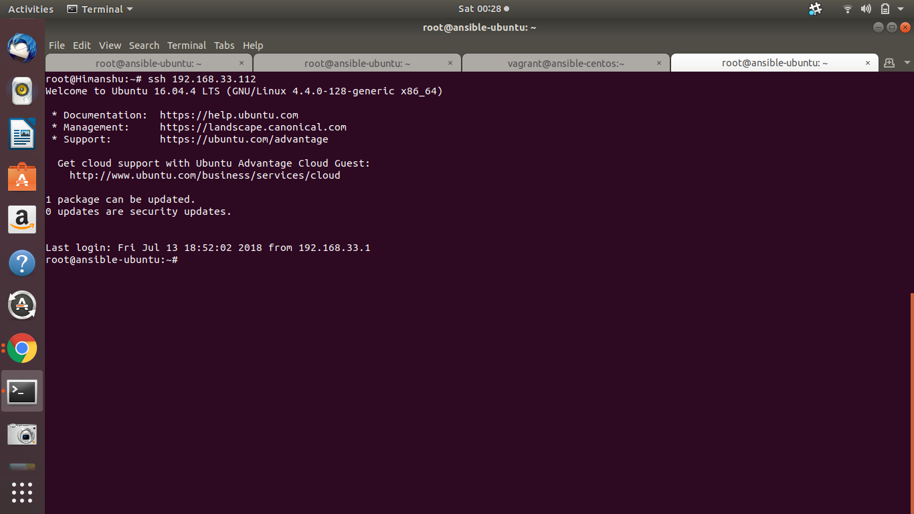
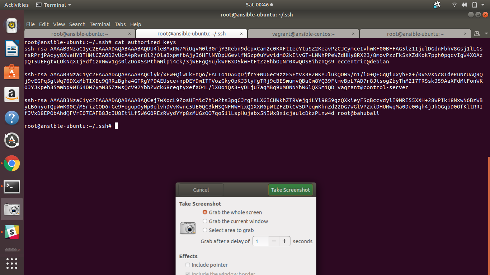
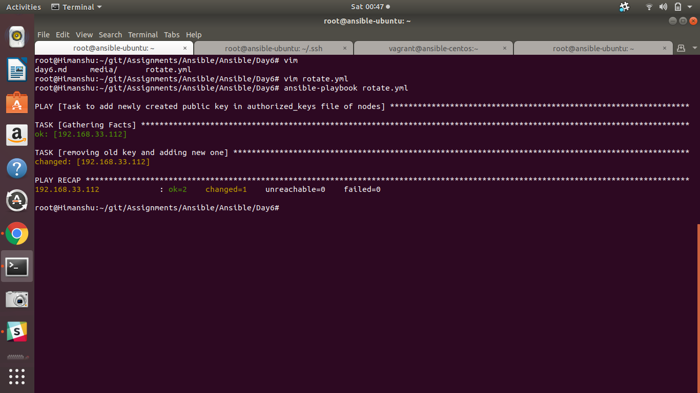
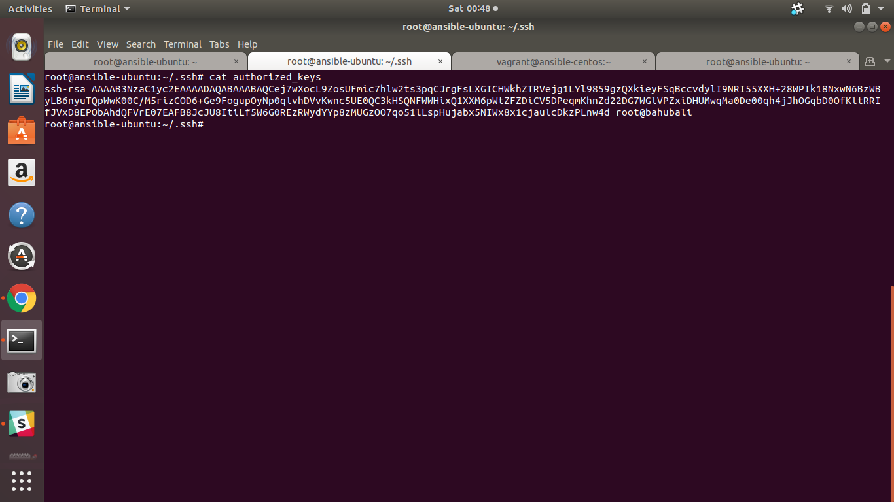
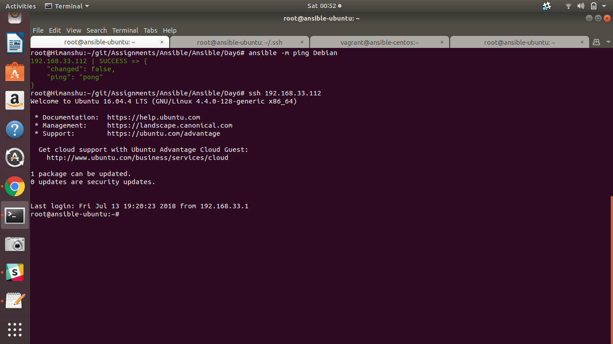

## Assignment

Create an Ansible playbook to rotate ssh keys. 
Explaination - Replacing the keys you’re currently using with new keys, and removing the ability for old keys to be used to log into your systems.
1. Create a new key  

$ ssh-keygen

1. Add new key to authorized_keys files on your nodes.

Copy key from id_rsa.pub and paste it in the authorized_keys of node.

1. Test new key

Did the above part manually and for below task used playbook.

1. Remove previous keys from authorized_keys files on your nodes.

Playbook created to rotate the keys using authorized_key module

Before rotation authorized key file on node

Rotation performed

after rotation

1. again test the connectivity with the new keys.

