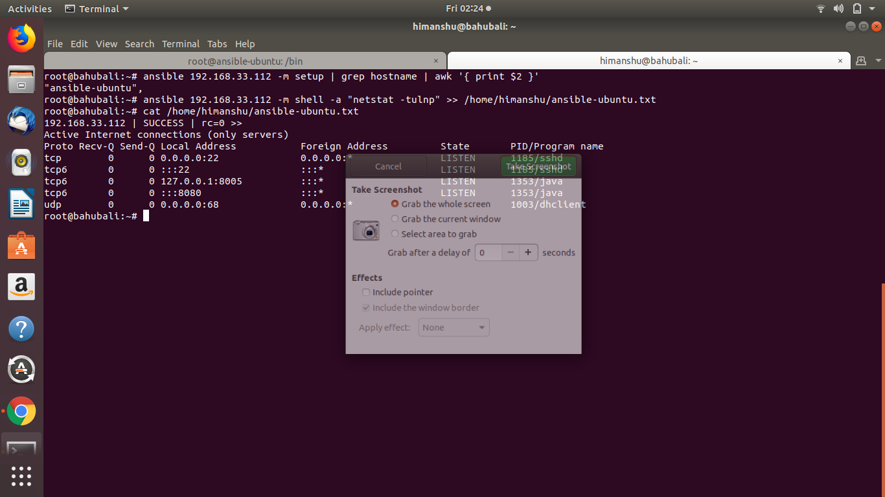
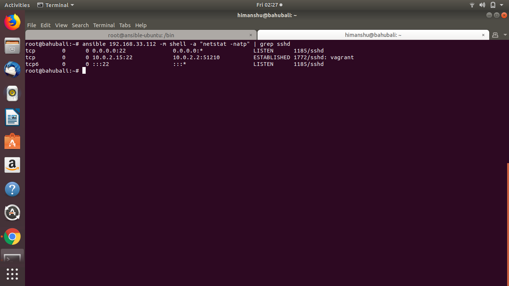
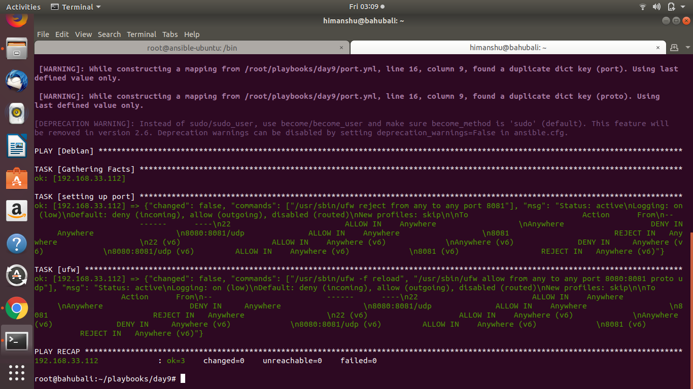
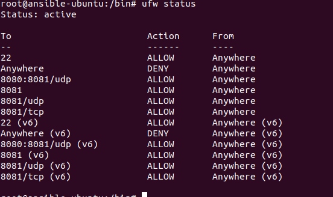

## The Assignment  
#### List All the open ports on the node machines and store the output in seprate files named with the hostname of the machine on the ansible master.  

##### to get hostname & store output:  
- ansible 192.168.33.112 -m setup | grep hostname | awk '{ print $2 }'  
- ansible 192.168.33.112 -m shell -a "netstat -tulnp" >> /home/himanshu/ansible-ubuntu.txt 

#### check if open ssh server is there or not on the machine.
- sudo netstat -natp | grep sshd

#### disable all ports other than 22 on the node machines.

#### Enable only port 8080 and 8081 on the node machines.

#### Again Check for open ports and append in same file with current date and time.

