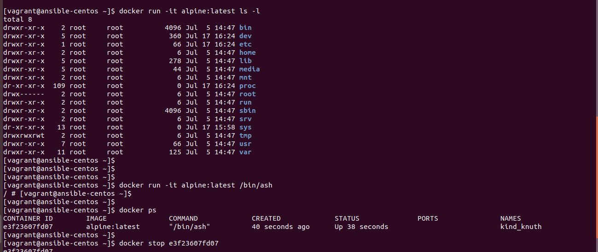

Assignment 1
-----------------------
1. Run a docker container from "hello-world" image.

$docker run hello-world

2. Pull "alpine" image from docker registry and see if image is available in your local image list.

$docker pull alpine

3. Pull some specific version of docker "alpine" image from docker registry.

$docker images

4. Run a docker container from local image "alpine" and run an inline command "ls -l" while running container.

$docker run -it alpine:latest ls -l

5. Try to take login to container created using "alpine" image.

$docker run -it alpine:latest /bin/bash

6. Detach yourself from the container without making it exit/container kill.

$ctrl^P^Q

7. Check running containers and see if you can find out the stopped containers.

$docker ps

8. Stop running container.

$docker stop "container ID"

to stop all the containers ast once

$docker stop $(docker ps)

9. Start container that was stopped earlier.

$docker start "container ID"

10. Try to remove "alpine" image from your local system.

$docker rmi alpine 

this couldn't be done without removing container

Assignment 2
---------------------
1. Again pull "alpine" image from docker registry.

$docker pull alpine

2. Take interactive login to bash while running docker container from "alpine" image.

$docker run -it alpine ash

3. Run command inside container: 
	echo "hello world" > hello.txt
	ls
4. Take exit from same container without killing the container.

CTRL^P^Q

5. Run another container using below command and check if you can find hello.txt within this container. You should find container isolations

file not found in other container.

6. Stop a container using Container ID.

$docker stop containerID

7. Start same container using ID and exec a command "echo 'hello world!'" in docker container without instantiating a new container.

8. Inspect already downloaded "alpine" docker image using docker inspect command.

$docker inspect alpine

9. Tag your local "alpine" image with name "myimage" along with version 1.0

